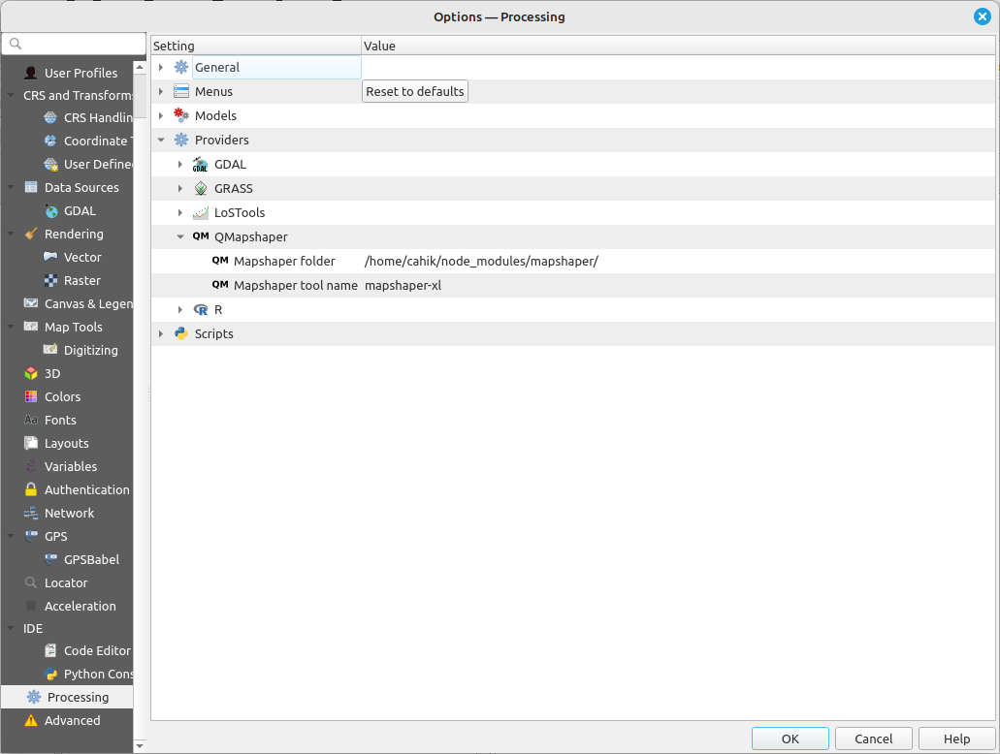
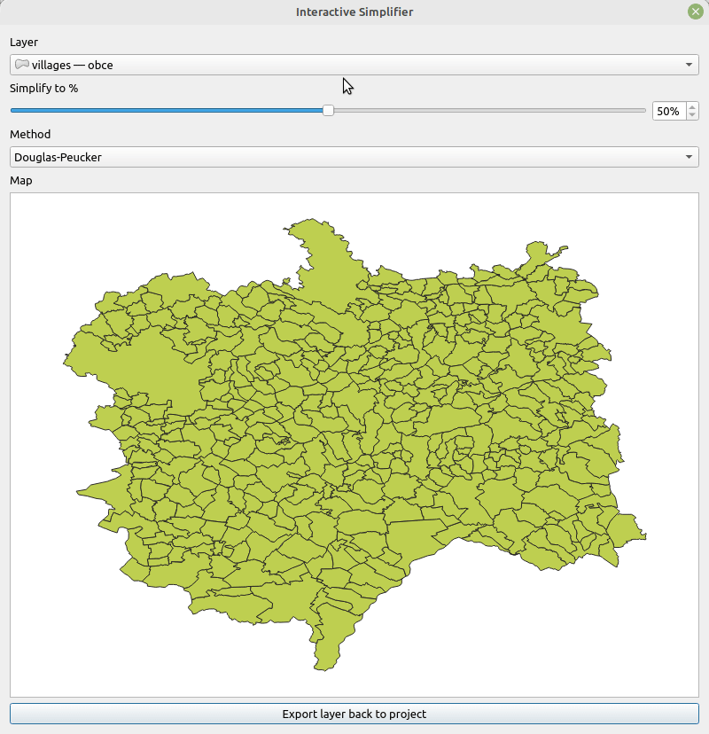
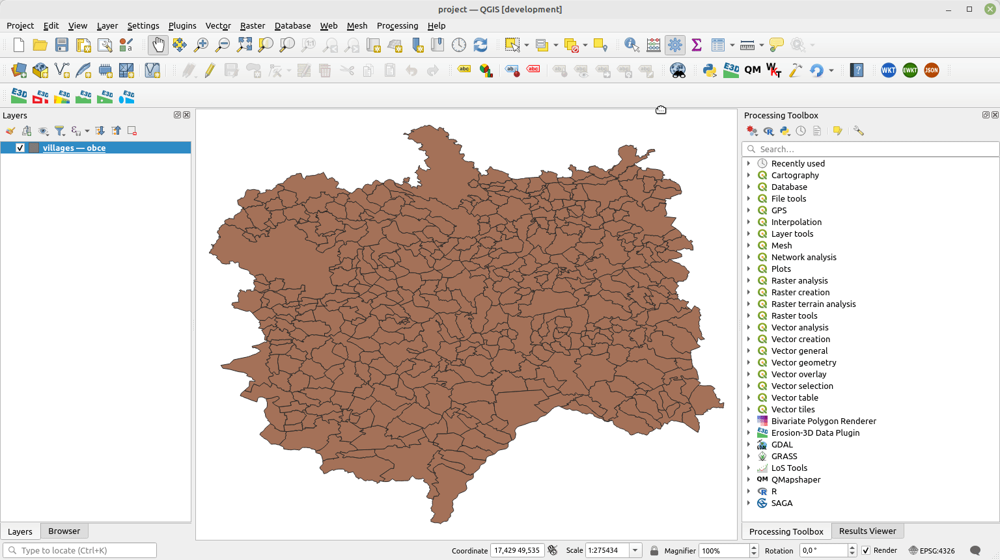

# QMapshaper

QGIS plugin to that allows running [mapshaper](https://github.com/mbloch/mapshaper) directly from QGIS as a processing tool or an interactive tool.

[](https://github.com/JanCaha/qgis-qmapshaper/actions/workflows/test_plugin.yaml)

## Link to QGIS Plugin repository

Plugin is available here: [https://plugins.qgis.org/plugins/qmapshaper/](https://plugins.qgis.org/plugins/qmapshaper/).

## Installation

Requires installation of NodeJS, npm and mapshaper.

### Linux

On most Linux distributions this should do:

```
sudo apt install nodejs
sudo apt install npm
npm install mapshaper
```

You can also install mapshaper globally for the system.

```
npm install -g mapshaper
```

### Windows

On Windows the setup may vary. You then need the path to `mapshaper` folder in `node_modules`. See details below.

## Setting up

In **QGIS settings** under **Processing** under **QMapshaper** the **_mapshaper_** folder needs to be set up.

On Linux this tends to be: `/home/user_name/node_modules/mapshaper`, where you just replace `user_name` with your user name. If this is not the case you have to investigate, where the folder is. Best way might be to search for file **mapshaper-gui** which is located in the `mapshaper/bin` directory.

There is also **Mapshaper tool name** setting that allows user to change the name of binary file to run. On Linux, this should not be needed but on Windows the command can be either __mapshaper-xl__ or also __mapshaper-xl.cmd__.

## Tools

So far there is processing tool **Simplify vector** usable in complex workflows. There is also **Interactive Simplifier** which is GUI tool that allows playing around interactively with the simplification parameters.

## Examples

### Plugin Settings

The settings requires `Mapshaper folder` and `Mapshaper tool name`. The tool name for Linux and Windows wary, but the plugin does it's best to set it up correctly. For Linux and MacOS it should be `mapshaper-xl` while on Windows `mapshaper-xl.cmd` should be the correct programme.



### Interactive Tool



### Use Case

